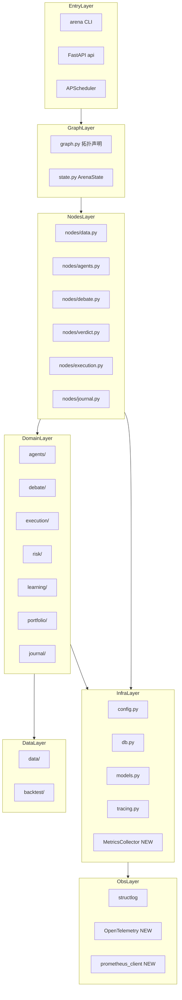
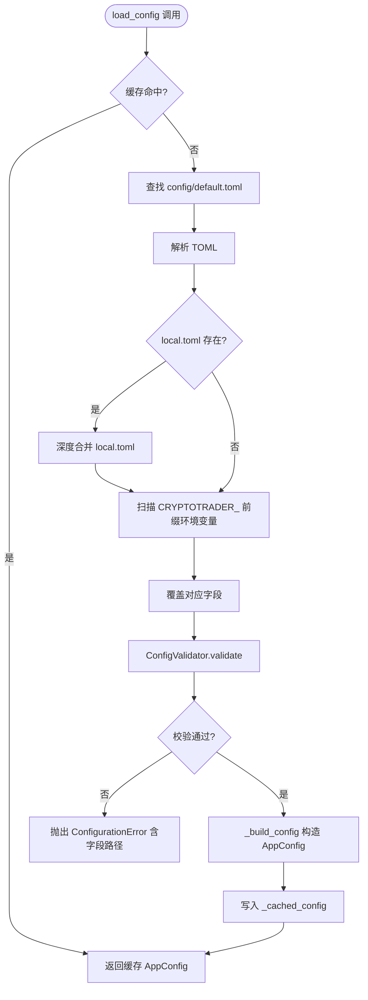
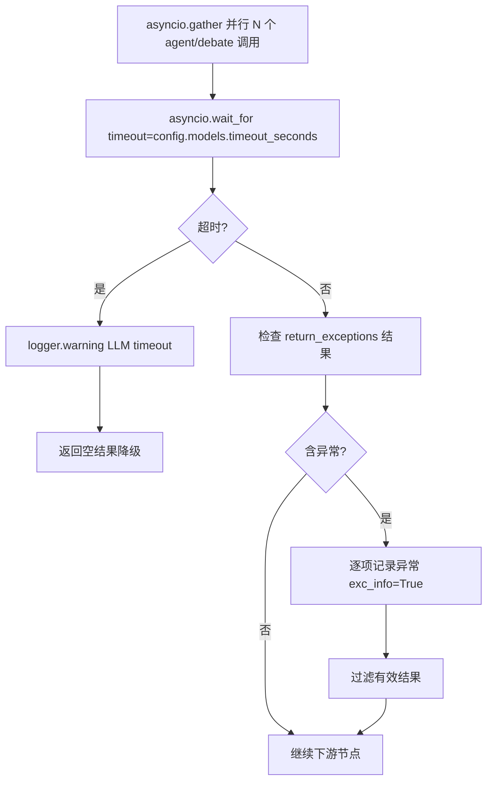
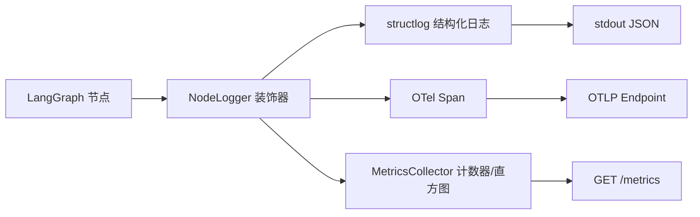

# 技术设计文档

## 概述

本设计文档将 CryptoTrader AI 的十个架构审查领域的需求转化为具体的技术决策、组件设计和实施模式。系统已具备坚实的领域驱动分层架构基础，本次审查聚焦于识别偏差点、强化现有弱项，并为缺失的基础设施（可观测性端点、CI 覆盖率门控、环境变量覆盖、生产安全加固）提供明确的设计方案。

设计范围覆盖从 `src/` 源码到 `docker-compose.yml`、`.github/workflows/ci.yml`、`pyproject.toml` 的全链路，以最小化改动保证最大化合规性为原则——对已符合要求的模式（`ExchangeAdapter` Protocol、`ArenaState` 数据契约、`create_llm()` 工厂、`load_config()` 单例）不做无谓重构，仅在存在真实合规缺口处引入新设计。

### 目标

- 所有十个需求领域均有对应的技术组件、接口定义和验收路径
- 可观测性层（`/metrics` 端点、structlog 规范化字段、OpenTelemetry span）从无到有建立
- 配置管理补全：`CRYPTOTRADER_*` 环境变量覆盖机制与 Pydantic 声明式校验
- 测试基础设施加固：pytest-cov 阈值门控、CI 覆盖率步骤、依赖分组拆分
- 安全实践标准化：pre-commit detect-secrets、FastAPI 生产模式、prompt 清洗

### 非目标

- 替换现有 `ExchangeAdapter` Protocol 实现（已符合需求 6.1）
- 重写 LangGraph 图拓扑或节点业务逻辑
- 引入新的 LLM 提供商或更换 LangChain 版本
- 数据库迁移或 Schema 变更（`db.py` 已提供共享会话工厂）

---

## 需求可追溯性

| 需求 | 摘要 | 主要组件 | 接口/合约 | 流程 |
|------|------|---------|-----------|------|
| 1.1 | 单向依赖约束 | `ImportBoundaryGuard`（ruff TID 规则） | ruff `banned-module-level-imports` | 静态分析 |
| 1.2 | graph.py 仅含拓扑声明 | `graph.py`（现有，符合） | — | — |
| 1.3 | 共享工具下沉基础设施 | `db.py`、`agents/base.py`、`state.py` | 现有共享接口 | — |
| 1.4 | ArenaState 唯一数据契约 | `state.py`（现有，符合） | `ArenaState` TypedDict | — |
| 1.5 | 消除循环导入 | ruff `TCH` + `TYPE_CHECKING` 保护 | — | — |
| 1.6 | 替代路径标注 | `graph_supervisor.py`、`langchain_agents.py` 顶部注释 | — | — |
| 2.1 | 禁止静默异常 | `ErrorHandlingPolicy`（编码规范强化） | — | — |
| 2.2 | LLM fallback 链 | `create_llm()`（现有 `.with_fallbacks()`） | `FallbackLLMChain` | — |
| 2.3 | 交易所异常结构化日志 | `OrderManager`、`LiveExchange` | 结构化字段 | 执行流 |
| 2.4 | 风控检查独立捕获 | `RiskGate.check()` 改造 | `RiskCheckResult` | 风控流 |
| 2.5 | Redis 不可用保守拒绝 | `RiskGate`（现有，符合） | — | — |
| 2.6 | 后台任务异常回调 | `TaskRegistry` | `on_task_exception` 回调 | 后台反思 |
| 2.7 | 调度器异常不停止 | `Scheduler._run_cycle()` try/except | — | — |
| 3.1 | 无硬编码数值 | `ConfigAudit`（静态检查） | — | — |
| 3.2 | load_config() 单例 | `config.py`（现有，符合） | — | — |
| 3.3 | 启动阶段 ConfigurationError | `ConfigValidator` | `ConfigurationError` | 启动 |
| 3.4 | 缺失凭证清晰提示 | `LiveCheckCommand` 改造 | — | CLI |
| 3.5 | Pydantic 声明式校验 | `AppConfig` dataclass 添加 validator | `field_validator` | — |
| 3.6 | CRYPTOTRADER_* 环境变量覆盖 | `EnvOverrideLoader` | 覆盖优先级链 | 启动 |
| 4.1 | 公开函数单元测试覆盖 | `tests/` 补齐 | pytest 规范 | — |
| 4.2 | LLM mock 模式 | 现有（符合） | `patch("langchain_openai.ChatOpenAI.ainvoke")` | — |
| 4.3 | 图拓扑集成测试 | `tests/test_graph.py` 补齐 | 节点/边断言 | — |
| 4.4 | CI 覆盖率缺口警告 | `.github/workflows/ci.yml` 步骤 | `pytest-cov` 输出 | CI |
| 4.5 | pytest-cov 最低阈值 70% | `pyproject.toml` `[tool.pytest]` | `--cov-fail-under=70` | CI |
| 4.6 | 回测集成测试无网络 | `tests/test_backtest.py` mock 模式 | SQLite 内存库 | — |
| 4.7 | asyncio_mode = "auto" | `pyproject.toml`（现有，符合） | — | — |
| 5.1 | gather + return_exceptions 逐检 | `nodes/debate.py`、`nodes/agents.py` | `GatherResult` | 并行流 |
| 5.2 | Task 引用持有防 GC | `TaskRegistry` | `add_background_task()` | 后台任务 |
| 5.3 | 禁止 async 内阻塞 I/O | ruff `ASYNC` 规则（现有，符合） | — | — |
| 5.4 | 共享状态 asyncio.Lock 保护 | `PaperExchange._lock` | `asyncio.Lock` | 执行 |
| 5.5 | gather 超时 asyncio.wait_for | `nodes/agents.py`、`nodes/debate.py` | `timeout_seconds` 配置 | LLM 调用 |
| 5.6 | 调度器 misfire 策略 | `Scheduler` APScheduler `max_instances=1` | `misfire_grace_time=0` | 调度 |
| 6.1 | 统一 ExchangeAdapter Protocol | `execution/exchange.py`（现有，符合） | `ExchangeAdapter` Protocol | — |
| 6.2 | 引擎切换零代码改动 | `nodes/execution.py _get_exchange()`（现有） | — | — |
| 6.3 | 交易所为仓位权威来源 | `nodes/execution.py`（现有，符合） | — | — |
| 6.4 | 未确认订单轮询重试 | `LiveExchange._wait_or_cancel()`（现有） | 告警通知 | 执行 |
| 6.5 | OrderManager 状态机 | `execution/order.py`（现有，符合） | `VALID_TRANSITIONS` | — |
| 6.6 | 多交易所选择集中 | `_get_exchange()` 工厂（现有） | — | — |
| 7.1 | 凭证仅从 TOML 读取 | `config.py ExchangeCredentials`（现有） | — | — |
| 7.2 | pre-commit detect-secrets | `.pre-commit-config.yaml`（现有，符合） | — | — |
| 7.3 | 外部响应 schema 校验 | `ExternalResponseValidator` | Pydantic 模型 | 数据采集 |
| 7.4 | FastAPI 422 + 日志 | `api/main.py` 异常处理（现有）+ 补全 | 请求摘要日志 | API |
| 7.5 | Prompt 注入防护 | `PromptSanitizer` | `sanitize_input()` 接口 | Agent 调用 |
| 7.6 | 生产关闭 /docs | `api/main.py` 条件初始化 | `DOCS_ENABLED` 环境变量 | API |
| 7.7 | verify=False 注释标注 | `data/sync.py`、`data/providers/sosovalue.py` 注释 | — | — |
| 8.1 | 辩论门控跳过 | `debate/convergence.py`（现有，符合） | — | — |
| 8.2 | 裁决降级加权 | `nodes/verdict.py`（现有，符合） | `verdict_downgraded_to_weighted` 日志 | — |
| 8.3 | SQLiteCache | `agents/base.py`（现有，符合） | — | — |
| 8.4 | 快照相同复用分析结果 | `SnapshotCacheLayer` | `snapshot_hash` 比对 | 数据节点 |
| 8.5 | Token 消耗结构化日志 | `LLMUsageLogger` | `llm_usage` 日志字段 | LLM 工厂 |
| 8.6 | 回测规则裁决 | `backtest/engine.py`（现有，符合） | — | — |
| 8.7 | gather 超时配置 | `config.models.timeout_seconds` 新字段 | `asyncio.wait_for` | LLM 调用 |
| 9.1 | structlog 统一日志字段 | `log_config.py` 规范化 | `LogFields` 标准字段集 | 全局 |
| 9.2 | trace_id 全链路传播 | `tracing.py`（现有）+ 节点绑定 | `set_trace_id()` | 流水线 |
| 9.3 | 节点入口/出口结构化日志 | `NodeLogger` 装饰器 | `node_entry`/`node_exit` 事件 | 所有节点 |
| 9.4 | 风控拒绝详细字段 | `risk_check()` 日志补全 | `check_name`、`current_value`、`threshold` | 风控 |
| 9.5 | `/metrics` Prometheus 端点 | `MetricsCollector`、`api/routes/metrics.py` | Prometheus 文本格式 | API |
| 9.6 | OpenTelemetry OTLP 导出 | `OTelInstrumentation` | `OTLP_ENDPOINT` 环境变量 | 可观测性 |
| 9.7 | API 请求日志 | `trace_middleware`（现有）补全字段 | `method`、`path`、`status_code`、`response_time_ms` | API |
| 10.1 | Docker Compose 完整服务 | `docker-compose.yml` 补全 | 服务定义 | 部署 |
| 10.2 | 多阶段 Docker 构建 | `Dockerfile`（现有，符合）优化 | 生产/builder 阶段分离 | 构建 |
| 10.3 | CI 流水线完整步骤 | `.github/workflows/ci.yml` 补全 | lint→format→test+cov→docker | CI |
| 10.4 | HEALTHCHECK 详细组件状态 | `api/routes/health.py` 补全 | `/health` 响应 Schema | 部署 |
| 10.5 | 服务资源限制 | `docker-compose.yml` deploy.resources | `mem_limit`、`cpus` | 部署 |
| 10.6 | 命名卷持久化 | `docker-compose.yml`（现有，部分）补全 | SQLite 挂载 | 部署 |
| 10.7 | pyproject.toml 依赖分组 | `pyproject.toml` `test` 组 | `[project.optional-dependencies]` | 构建 |

---

## 架构

### 现有架构分析

CryptoTrader AI 当前的架构已高度结构化：

- **依赖方向**：`nodes/` → 领域层（`agents/`、`debate/`、`execution/`、`risk/`、`learning/`）→ 基础设施（`db.py`、`config.py`、`state.py`）。方向总体正确，但 `nodes/verdict.py` 在函数体内通过延迟导入引用 `nodes/execution.py`（`read_portfolio_from_exchange`），形成隐性同层依赖，需抽取到共享层。
- **数据契约**：`ArenaState` TypedDict 是唯一跨节点数据载体，`merge_dicts` reducer 正确处理嵌套合并，无全局变量传递。
- **配置单例**：`load_config()` 使用模块级 `_cached_config` 实现单例，已支持 `local.toml` 覆盖，缺少 `CRYPTOTRADER_*` 环境变量层。
- **交易所抽象**：`ExchangeAdapter` Protocol 配合 `@runtime_checkable`，`PaperExchange`/`LiveExchange` 均实现全部方法，`_get_exchange()` 工厂集中选择逻辑，符合需求 6。
- **可观测性缺口**：`tracing.py` 提供 `trace_id` 上下文绑定，但缺少 `/metrics` Prometheus 端点、节点级耗时结构化日志、OpenTelemetry 集成。
- **测试基础设施**：37 个测试文件，但 `pyproject.toml` 未配置 `pytest-cov`，CI 无覆盖率门控，`test` 依赖组与 `dev` 混合。
- **部署**：`docker-compose.yml` 缺少服务资源限制，SQLite 数据目录未挂载命名卷，CI 无覆盖率步骤。

### 架构模式与边界图



**关键设计决策**：

- `nodes/verdict.py` 中对 `nodes/execution.py.read_portfolio_from_exchange` 的同层引用，通过将该函数提升为 `portfolio/manager.py` 的方法来消除。
- 可观测性组件（`MetricsCollector`、`OTelInstrumentation`）归属基础设施层，不引入新的领域依赖。
- 新增 `EnvOverrideLoader` 在 `load_config()` 内部处理环境变量，不改变调用方接口。

### 技术栈

| 层 | 选型 / 版本 | 在本次审查中的角色 | 说明 |
|---|---|---|---|
| Python | 3.12+ | 全局 | 无变化 |
| LangGraph | 1.x | 图编排（现有） | 无变化 |
| LangChain | 1.2+ | LLM 调用（现有） | 无变化 |
| structlog | 24.1+ | 统一日志（现有，补规范） | 新增标准字段集 |
| prometheus-client | 0.20+ | `/metrics` 端点 | **新增依赖** |
| opentelemetry-sdk | 1.25+ | 分布式追踪 | **新增依赖（可选）** |
| opentelemetry-exporter-otlp | 1.25+ | OTLP 导出 | **新增依赖（可选）** |
| pytest-cov | 5.x | 覆盖率测试 | **新增 test 组依赖** |
| Docker multi-stage | 现有 | 生产镜像优化 | 补充 uv 排除 |
| APScheduler | 3.10 | 调度（现有） | 补 max_instances=1 |

---

## 系统流程

### 配置加载与环境变量覆盖流程



### LLM 并行调用超时保护流程



### 可观测性数据流



---

## 组件与接口

### 组件总览

| 组件 | 层 | 意图 | 需求覆盖 | 关键依赖 | 合约类型 |
|---|---|---|---|---|---|
| `EnvOverrideLoader` | 基础设施/配置 | CRYPTOTRADER_* 环境变量覆盖 | 3.6 | `config.py` | Service |
| `ConfigValidator` | 基础设施/配置 | 启动阶段字段校验与 ConfigurationError | 3.3, 3.5 | `config.py` 数据类 | Service |
| `TaskRegistry` | 基础设施/并发 | 持有后台 Task 引用防 GC，添加异常回调 | 2.6, 5.2 | asyncio | State |
| `PromptSanitizer` | 基础设施/安全 | LLM prompt 长度限制与特殊字符过滤 | 7.5 | `agents/base.py` | Service |
| `ExternalResponseValidator` | 数据层 | 外部 API 响应 Pydantic schema 校验 | 7.3 | `models.py` | Service |
| `SnapshotCacheLayer` | 数据层 | 快照 hash 比对，相同快照复用分析结果 | 8.4 | `nodes/data.py` | State |
| `LLMUsageLogger` | 基础设施/可观测性 | 记录每次 LLM 调用的 token 消耗 | 8.5 | `agents/base.py`、structlog | Service |
| `NodeLogger` | 基础设施/可观测性 | 节点入口/出口结构化日志与耗时 | 9.3 | structlog、`tracing.py` | Service |
| `MetricsCollector` | 基础设施/可观测性 | Prometheus 指标注册与采集 | 9.5 | prometheus-client | Service |
| `OTelInstrumentation` | 基础设施/可观测性 | OpenTelemetry tracer 初始化与 span 导出 | 9.6 | opentelemetry-sdk | Service |
| `api/routes/metrics.py` | API 层 | 暴露 `/metrics` Prometheus 端点 | 9.5 | `MetricsCollector` | API |
| `RiskGate`（改造） | 领域/风控 | 独立捕获每项检查异常，详细日志 | 2.4, 9.4 | `risk/checks/` | Service |
| `PaperExchange`（改造） | 领域/执行 | 添加 `asyncio.Lock` 保护共享状态 | 5.4 | asyncio | State |
| CI / `pyproject.toml`（改造） | DevOps | 覆盖率门控、依赖分组、CI 步骤 | 4.4, 4.5, 10.3, 10.7 | pytest-cov | Batch |
| `docker-compose.yml`（改造） | DevOps | 资源限制、命名卷、完整服务配置 | 10.1, 10.5, 10.6 | Docker | Batch |

---

### 基础设施层

#### EnvOverrideLoader

| 字段 | 详情 |
|---|---|
| Intent | 解析 `CRYPTOTRADER_*` 环境变量，按键路径覆盖已解析的 TOML 数据字典 |
| Requirements | 3.6 |

**职责与约束**

- 在 `_build_config()` 调用前，将形如 `CRYPTOTRADER_RISK__LOSS__MAX_DAILY_LOSS_PCT=0.05` 的环境变量转换为嵌套字典并深度合并至 TOML 数据。
- 双下划线 `__` 作为键层级分隔符，单下划线允许出现在键名内。
- 覆盖优先级：`CRYPTOTRADER_*` 环境变量 > `local.toml` > `default.toml`。
- 类型转换规则：值为 `"true"`/`"false"` 转 `bool`，纯数字字符串转 `int` 或 `float`，其余保留 `str`。
- 此组件不引入任何外部依赖，仅使用 `os.environ` 标准库。

**依赖**

- 入站：`load_config()` — 在解析 TOML 后、构建 `AppConfig` 前调用（P0）
- 无出站外部依赖

**合约**：Service [x]

##### Service 接口

```python
def apply_env_overrides(toml_data: dict[str, object]) -> dict[str, object]:
    """将 CRYPTOTRADER_* 环境变量覆盖合并至 toml_data，返回新字典（不修改原始输入）。

    示例：
      CRYPTOTRADER_RISK__LOSS__MAX_DAILY_LOSS_PCT=0.03
      → toml_data["risk"]["loss"]["max_daily_loss_pct"] = 0.03
    """
```

- 前置条件：`toml_data` 为已解析的 TOML 字典
- 后置条件：返回字典与 `toml_data` 深度相同，环境变量键对应字段已被覆盖
- 不变量：不修改 `os.environ`；无副作用

**实施说明**

- 集成：在 `config.py` 的 `load_config()` 函数中，于 `local.toml` 合并之后、`_build_config()` 调用之前插入 `apply_env_overrides(toml_data)` 调用。
- 验证：类型转换失败时记录 `logger.warning` 并跳过该键（不中断启动），仅 `ConfigValidator` 负责字段缺失/类型错误的硬失败。
- 风险：双下划线路径解析可能与含下划线的 TOML 键名冲突，需在文档中明确约定。

---

#### ConfigValidator

| 字段 | 详情 |
|---|---|
| Intent | 在进程启动阶段对 `AppConfig` 各字段进行声明式约束校验，不符合则抛出 `ConfigurationError` |
| Requirements | 3.3, 3.5 |

**职责与约束**

- 当前 `config.py` 使用 `@dataclass` 而非 Pydantic，无内置校验。本组件以两种方式补全：
  1. **`ConfigurationError`**：新建 `class ConfigurationError(ValueError)` 含 `field_path: str` 和 `expected: str` 属性，在 `load_config()` 返回前调用 `validate_config(cfg)` 触发。
  2. **关键字段约束**：在 `_build_config()` 尾部或独立 `validate_config()` 函数中，对以下字段执行断言：`risk.loss.max_daily_loss_pct` ∈ (0, 1)、`risk.position.max_single_pct` ∈ (0, 1)、`debate.consensus_skip_threshold` ∈ (0, 1)、`models.fallback` 非空。
- 不引入 Pydantic（避免重写现有 dataclass 层），采用轻量函数式校验。

**合约**：Service [x]

```python
class ConfigurationError(ValueError):
    field_path: str
    expected: str

def validate_config(cfg: AppConfig) -> None:
    """校验 AppConfig 关键约束，违反则抛出 ConfigurationError。"""
```

- 前置条件：`cfg` 为已构建的 `AppConfig` 实例
- 后置条件：无异常则保证关键字段在合法范围
- 不变量：不修改 `cfg`

**实施说明**

- 集成：在 `load_config()` 的 `_cached_config = _build_config(toml_data)` 行之后立即调用 `validate_config(_cached_config)`。
- 风险：若现有 `config/default.toml` 的默认值本身不符合约束（如 `models.fallback = ""`），需先修正 TOML 默认值。

---

#### TaskRegistry

| 字段 | 详情 |
|---|---|
| Intent | 持有后台 `asyncio.Task` 对象引用，防止 GC 回收，并为每个 Task 注册异常回调 |
| Requirements | 2.6, 5.2 |

**职责与约束**

- Python `asyncio` 文档明确说明：若 `Task` 对象没有外部引用，GC 可在任意时刻回收并取消它。`learning/reflect.py`（`verbal_reinforcement` 触发的后台反思）当前使用 `loop.create_task()` 但未持有引用。
- `TaskRegistry` 提供模块级单例 `Set[asyncio.Task]`，`add_background_task()` 包装 `loop.create_task()`，在 Task 完成回调中从集合中移除并记录异常。

**合约**：State [x]

```python
_background_tasks: set[asyncio.Task] = set()

def add_background_task(coro: Coroutine, name: str | None = None) -> asyncio.Task:
    """创建后台 Task，持有引用并注册异常回调。返回 Task 对象。"""

def _on_task_done(task: asyncio.Task, name: str) -> None:
    """Task 完成回调：从注册集合移除；若有异常则 logger.warning(exc_info=True)。"""
```

- 后置条件：Task 创建后引用存入 `_background_tasks`；完成后移除
- 不变量：集合只增不改；Task 完成（正常或异常）后移除

**实施说明**

- 集成：在 `nodes/data.py` 的 `verbal_reinforcement()` 中，将 `loop.create_task(reflect_coro)` 替换为 `add_background_task(reflect_coro, name="reflect")`。
- 位置：`TaskRegistry` 模块置于 `src/cryptotrader/task_registry.py`，作为基础设施层文件。
- 风险：后台反思任务若无限运行或持续失败，集合可能增长；回调需确保移除逻辑在 finally 中执行。

---

#### PromptSanitizer

| 字段 | 详情 |
|---|---|
| Intent | 对注入 LLM prompt 的外部数据（新闻标题、链上数据文本、用户输入）执行长度限制与控制字符过滤，防止 prompt 注入 |
| Requirements | 7.5 |

**职责与约束**

- 作用位置：`BaseAgent._build_prompt()` 中对外部来源字段（`snapshot.news.headlines`、`snapshot.onchain.*`）调用 `sanitize_input()` 后再拼接进 prompt。
- 长度限制：单个外部文本字段截断至 `max_chars`（默认 2000，可通过 `config` 扩展）；总 prompt 长度限制由 `config.llm.timeout` 的 token 预算间接约束。
- 字符过滤：移除 Unicode 控制字符（`\x00`–`\x1f` 除 `\n\t`）和注入尝试（如连续多个换行 + 指令前缀 `"Ignore previous instructions"`）。
- 不对 Agent 内部系统 prompt（`role_description`、`ANALYSIS_FRAMEWORK`）应用，只针对外部数据来源。

**合约**：Service [x]

```python
def sanitize_input(text: str, max_chars: int = 2000) -> str:
    """清洗外部文本：截断、过滤控制字符、检测常见注入模式。"""
```

- 前置条件：`text` 为来自外部数据源的原始字符串
- 后置条件：返回长度 ≤ `max_chars` 且不含控制字符的字符串
- 不变量：不抛出异常；无法清洗时返回截断的安全子串

**实施说明**

- 位置：`src/cryptotrader/security.py`（新文件），基础设施层。
- 集成：在 `agents/base.py` 的 `_build_prompt()` 中导入 `sanitize_input` 并对 `snapshot.news.headlines` 列表元素逐项调用。
- 风险：过于激进的过滤可能破坏含特殊字符的合法市场数据（如 Token 名含 `&`），需在测试中验证边界。

---

### 可观测性层

#### MetricsCollector

| 字段 | 详情 |
|---|---|
| Intent | 注册并维护系统核心 Prometheus 指标，暴露给 `/metrics` 端点 |
| Requirements | 9.5 |

**职责与约束**

- 使用 `prometheus-client` 库（新增生产依赖），在模块加载时注册以下指标：

| 指标名 | 类型 | 标签 | 说明 |
|---|---|---|---|
| `ct_llm_calls_total` | Counter | `model`, `node` | LLM 调用总次数（含 fallback）|
| `ct_debate_skipped_total` | Counter | — | 辩论跳过次数 |
| `ct_verdict_total` | Counter | `action` | 裁决分布（buy/sell/hold/close）|
| `ct_risk_rejected_total` | Counter | `check_name` | 风控拒绝次数（按检查项）|
| `ct_trade_executed_total` | Counter | `engine`, `side` | 订单执行次数 |
| `ct_execution_latency_ms` | Histogram | `engine` | 订单执行端到端延迟（P50/P95/P99）|
| `ct_pipeline_duration_ms` | Histogram | — | 完整流水线耗时 |

- 模块级单例：`get_metrics_collector()` 返回全局注册的 `MetricsCollector` 实例。
- 生产环境禁用 `prometheus-client` 默认的 `/metrics` 端口（9090），改由 FastAPI 路由暴露，避免端口冲突。

**依赖**

- 出站：`prometheus_client`（外部库，P0）
- 入站：`nodes/debate.py`、`nodes/verdict.py`、`nodes/execution.py`、`create_llm()` 调用点（P1）

**合约**：Service [x]

```python
class MetricsCollector:
    def record_llm_call(self, model: str, node: str) -> None: ...
    def record_debate_skipped(self) -> None: ...
    def record_verdict(self, action: str) -> None: ...
    def record_risk_rejection(self, check_name: str) -> None: ...
    def record_trade_executed(self, engine: str, side: str) -> None: ...
    def observe_execution_latency(self, engine: str, duration_ms: float) -> None: ...
    def observe_pipeline_duration(self, duration_ms: float) -> None: ...
    def generate_latest(self) -> bytes: ...  # Prometheus 文本格式

def get_metrics_collector() -> MetricsCollector: ...
```

**实施说明**

- 位置：`src/cryptotrader/metrics.py`（新文件）。
- 集成点：`create_llm()` 在 `agents/base.py` 中调用 `get_metrics_collector().record_llm_call()`；`debate_gate()` 在 `nodes/debate.py` 中在跳过时调用 `.record_debate_skipped()`；`make_verdict()` 调用 `.record_verdict()`；`risk_check()` 在拒绝时调用 `.record_risk_rejection(result.rejected_by)`。
- 风险：`prometheus-client` 不允许重复注册同名指标（测试间 `CollectorRegistry` 冲突），测试需使用 `CollectorRegistry()` 独立实例。

---

#### api/routes/metrics.py

| 字段 | 详情 |
|---|---|
| Intent | 暴露 `GET /metrics` 端点，返回 Prometheus 文本格式指标 |
| Requirements | 9.5 |

**合约**：API [x]

| 方法 | 端点 | 请求 | 响应 | 错误 |
|---|---|---|---|---|
| GET | /metrics | — | `text/plain; version=0.0.4` Prometheus 格式 | 500 |

**实施说明**

- 端点不需要 API Key 认证（与 `/health` 相同，供 Prometheus scraper 无认证访问）。
- 若需保护，可通过 `METRICS_AUTH_TOKEN` 环境变量配置 Bearer 认证。

---

#### NodeLogger

| 字段 | 详情 |
|---|---|
| Intent | 为所有 LangGraph 节点函数提供统一的入口/出口结构化日志与耗时记录 |
| Requirements | 9.3 |

**职责与约束**

- 实现为 Python 装饰器 `@node_logger`，包裹异步节点函数，在入口记录 `node_entry` 事件，在出口记录 `node_exit` 事件（含 `duration_ms`）。
- 集成现有 `tracing.py` 的 `trace_id`，通过 `structlog.contextvars` 传播（已在 `set_trace_id()` 中绑定）。
- 不依赖 `run_graph_traced()`（该函数依赖 `astream` 无法捕获内部耗时），改在节点级精确计时。

**合约**：Service [x]

```python
def node_logger(node_name: str | None = None):
    """节点日志装饰器工厂。用于 async def 节点函数。

    使用方式：
        @node_logger()
        async def collect_snapshot(state: ArenaState) -> dict: ...
    """
```

- 日志字段：`event`（`node_entry`/`node_exit`）、`node`、`duration_ms`（仅 exit）、`trace_id`（从 contextvars 读取）

**实施说明**

- 位置：`src/cryptotrader/tracing.py`（扩展现有文件，避免新增文件）。
- 集成：对 `nodes/` 下所有公开节点函数添加 `@node_logger()` 装饰器；节点函数签名不变，对 LangGraph 透明。
- 风险：装饰器包裹后 LangGraph 的 `get_type_hints()` 仍需正确解析函数签名，需使用 `functools.wraps` 保留 `__wrapped__` 属性。

---

#### OTelInstrumentation

| 字段 | 详情 |
|---|---|
| Intent | 初始化 OpenTelemetry tracer，将 LLM 调用 span 和节点 span 导出至 OTLP 端点 |
| Requirements | 9.6 |

**职责与约束**

- 仅在环境变量 `OTLP_ENDPOINT` 非空时激活，否则静默跳过（可选组件）。
- 在 `api/main.py` 的 `lifespan()` 中初始化；CLI 入口 `arena` 在 `setup_logging()` 之后初始化。
- `opentelemetry-sdk` 和 `opentelemetry-exporter-otlp` 作为可选依赖（`pyproject.toml [project.optional-dependencies] otel`），不强制安装。

**合约**：Service [x]

```python
def setup_otel(service_name: str = "cryptotrader-ai") -> None:
    """初始化 OTel SDK。若 OTLP_ENDPOINT 未配置则静默返回。"""

def get_tracer() -> opentelemetry.trace.Tracer:
    """返回当前进程的 OTel Tracer，未初始化则返回 NoOpTracer。"""
```

**实施说明**

- 位置：`src/cryptotrader/otel.py`（新文件）。
- LLM span：在 `create_llm()` 的 `llm.ainvoke()` 调用前后，通过 `get_tracer().start_as_current_span("llm.ainvoke")` 包裹。
- 节点 span：`@node_logger()` 装饰器内同时创建 OTel span，实现日志与追踪的关联。

---

### 领域层改造

#### RiskGate（改造）

| 字段 | 详情 |
|---|---|
| Intent | 改造 `RiskGate.check()` 使每项检查的异常独立捕获，不中断其余检查；完善风控拒绝日志字段 |
| Requirements | 2.4, 9.4 |

**现有问题**：`gate.py` 的 `check()` 循环在 `await c.evaluate()` 处若抛出异常会终止整个循环，导致后续检查项跳过。

**改造设计**

- 将 `for c in self._checks` 内的 `await c.evaluate()` 包裹在独立 `try/except` 中，捕获异常后记录 `logger.warning(exc_info=True)` 并将该检查视为"未通过（check_error）"，继续执行下一项。
- 在 `nodes/verdict.py` 的 `risk_check()` 中，对拒绝事件补充日志字段：`check_name`、`current_value`（若检查器返回）、`threshold`（若可读取）。

**合约**：Service [x]

```python
class RiskGate:
    async def check(self, verdict: TradeVerdict, portfolio: dict) -> GateResult:
        """执行所有风控检查。每项检查独立捕获异常。"""
```

- 不变量：任意单项检查异常不中断其余检查；最终结果为"所有检查通过则放行，任一失败则拒绝"

---

#### PaperExchange（改造）

| 字段 | 详情 |
|---|---|
| Intent | 为 `PaperExchange` 的内部状态（余额、仓位字典）添加 `asyncio.Lock` 保护，防止并发写入竞态 |
| Requirements | 5.4 |

**现有问题**：`PaperExchange` 在 `scheduler.py` 中被多对交易对的并发 `_run_cycle()` 调用，`place_order()` 和 `get_positions()` 可能并发修改同一字典。

**改造设计**

- 在 `PaperExchange.__init__()` 中创建 `self._lock = asyncio.Lock()`。
- 所有写入内部状态的方法（`place_order()`、`_update_balance()`）使用 `async with self._lock:`。
- 只读方法（`get_balance()`、`get_positions()`）使用 `async with self._lock:` 进行快照读。

**合约**：State [x]

- 并发策略：`asyncio.Lock`（单进程内协程级别，非线程级别）
- 一致性：`Lock` 范围覆盖从余额读取到余额更新的原子操作

---

### DevOps 层

#### 测试基础设施（pyproject.toml 改造）

| 字段 | 详情 |
|---|---|
| Intent | 拆分 `test` 依赖组，配置 pytest-cov 最低 70% 分支覆盖率阈值 |
| Requirements | 4.4, 4.5, 10.7 |

**改造内容**

```toml
# pyproject.toml 目标状态

[project.optional-dependencies]
test = [
    "pytest>=8.0",
    "pytest-asyncio>=0.24",
    "pytest-cov>=5.0",
]
dev = [
    "ruff>=0.8",
    "pre-commit>=3.0",
]
otel = [
    "opentelemetry-sdk>=1.25",
    "opentelemetry-exporter-otlp-proto-grpc>=1.25",
]

[tool.pytest.ini_options]
asyncio_mode = "auto"
testpaths = ["tests"]
pythonpath = ["src"]
addopts = "--cov=src --cov-report=term-missing --cov-fail-under=70 --cov-branch"
```

**实施说明**

- CI 中使用 `uv pip install -e ".[test]"` 替代 `.[dev]`，生产镜像不安装 `test` 组。
- `--cov-branch` 启用分支覆盖率（比行覆盖率更严格，与需求 4.5 "分支覆盖率"一致）。

---

#### CI 流水线（ci.yml 改造）

| 字段 | 详情 |
|---|---|
| Intent | 在现有 CI 步骤中增加覆盖率门控，并将安装目标从 `dev` 改为 `test` |
| Requirements | 4.4, 10.3 |

**目标 ci.yml 关键步骤**（相对现有改动）

```yaml
- name: Install test dependencies
  run: uv pip install -e ".[test]"

- name: Lint
  run: uv run ruff check src/ tests/

- name: Format check
  run: uv run ruff format --check src/ tests/

- name: Test with coverage
  run: uv run pytest tests/ -v --tb=short
  # pytest 的 addopts 已含 --cov-fail-under=70，覆盖率不足时此步骤自动失败

- name: Build Docker image
  if: github.ref == 'refs/heads/main'
  run: docker build -t cryptotrader-ai:${{ github.sha }} .
```

---

#### Docker Compose（改造）

| 字段 | 详情 |
|---|---|
| Intent | 补全服务资源限制、SQLite 命名卷、FastAPI 服务独立定义（区分 api 与 scheduler） |
| Requirements | 10.1, 10.5, 10.6 |

**改造要点**

- **资源限制**：为 `api`、`scheduler`、`dashboard` 服务添加 `deploy.resources.limits`（`memory: 512m`、`cpus: "1.0"`），`postgres`/`redis` 依实际资源配置。
- **SQLite 命名卷**：新增 `ctdata` 命名卷，挂载至 `api`/`scheduler`/`dashboard` 服务的 `/home/appuser/.cryptotrader`，确保 SQLite 数据文件（`market_data.db`、`llm_cache.db`）跨容器重启持久化。
- **服务命名对齐**：当前 `app` 服务重命名为 `api`，与需求 10.1 服务列表一致。
- **生产文档端点**：`api` 服务通过 `DOCS_ENABLED=false` 环境变量禁用 `/docs` 和 `/redoc`（见 7.6）。

**目标 volumes 块**

```yaml
volumes:
  pgdata:
  redisdata:
  ctdata:  # 新增 SQLite 持久化卷
```

---

## 数据模型

### 新增配置字段

**`ModelConfig` 新增字段**（`config.py`）

```python
@dataclass
class ModelConfig:
    # 现有字段...
    timeout_seconds: int = 60  # 需求 8.7：LLM 单次调用超时（asyncio.wait_for）
```

**`LLMConfig` 无新增字段**（超时统一由 `ModelConfig.timeout_seconds` 管理，`LLMConfig.timeout` 为 LangChain 连接层超时，语义不同）。

**`AppConfig` 新增字段**（`config.py`）

```python
@dataclass
class AppConfig:
    # 现有字段...
    # 无新增顶层字段；DOCS_ENABLED 通过环境变量读取，不进入配置对象
```

### 日志字段规范（LogFields）

所有 structlog 日志条目的标准字段集（通过 `log_config.py` 的处理器注入）：

| 字段 | 类型 | 来源 | 说明 |
|---|---|---|---|
| `timestamp` | ISO8601 str | structlog `TimeStamper` | 始终存在 |
| `level` | str | structlog | 始终存在 |
| `module` | str | Python `__name__` | 始终存在 |
| `trace_id` | str \| None | `tracing.contextvars` | 流水线执行期间存在 |
| `symbol` | str \| None | 节点从 `state.metadata.pair` 注入 | 流水线执行期间存在 |
| `node` | str \| None | `@node_logger()` 装饰器注入 | 节点执行期间存在 |
| `duration_ms` | int \| None | `@node_logger()` exit 事件 | 节点 exit 时存在 |
| `trade_id` | str \| None | `journal_trade()` 注入 | 交易执行时存在 |

### 外部 API 响应校验模型

`ExternalResponseValidator` 使用以下 Pydantic 模型对外部数据源响应进行 schema 校验（现有 `models.py` 扩展）：

```python
from pydantic import BaseModel, field_validator

class NewsHeadlineResponse(BaseModel):
    title: str
    published_at: str | None = None
    source: str | None = None

    @field_validator("title")
    @classmethod
    def title_nonempty(cls, v: str) -> str:
        if not v.strip():
            raise ValueError("title must not be empty")
        return v

class OnchainMetricResponse(BaseModel):
    value: float
    timestamp: int | None = None
    metric_name: str
```

---

## 错误处理

### 错误策略

本系统采用"快速失败于配置层、优雅降级于运行层"原则：

- **配置层**（启动时）：`ConfigurationError` 立即中断进程启动，含明确字段路径和期望类型，方便运维定位。
- **LLM 调用层**（运行时）：`.with_fallbacks()` 链自动切换备用模型；`asyncio.wait_for` 超时降级为空结果；`BaseAgent.analyze()` 的 `except Exception` 返回 `is_mock=True` 的降级分析。
- **风控层**（运行时）：单项检查异常不中断整体；Redis 不可用保守拒绝。
- **后台任务层**：`TaskRegistry._on_task_done` 记录异常，不影响主流水线。

### 错误分类与响应

**配置错误（启动时）**

- `ConfigurationError`：进程以非零退出码终止，错误信息写入 stderr，`field_path` 和 `expected` 字段供运维直接定位。

**LLM 错误（运行时）**

- 网络超时/限速 → `with_fallbacks()` 触发 fallback 模型，日志记录 `fallback_triggered=True`、`original_error`。
- 全部模型失败 → `BaseAgent.analyze()` 返回 `is_mock=True`；若所有 Agent 均为 mock，`make_verdict()` 强制 `hold` 裁决。
- `asyncio.wait_for` 超时 → 记录 `logger.warning("LLM timeout")`，以空/降级结果继续。

**交易所错误（运行时）**

- CCXT 异常 → `LiveExchange._retry()` 重试（指数退避）；fatal 错误（`AuthenticationError`、`InsufficientFunds`）直接上抛至 `OrderManager`，记录结构化字段 `exchange_id`、`symbol`、`error_code`、`retry_count`。
- 订单确认超时 → `_wait_or_cancel()` 尝试撤单，触发 `portfolio_stale` 通知事件。

**FastAPI 错误（API 层）**

- `RequestValidationError` → 422 响应，日志记录请求摘要（不含请求体原文、不含敏感字段）。
- 未处理异常 → 500 响应（现有 `global_exception_handler`），不泄露堆栈。

### 监控

- 所有 `except` 块强制 `logger.warning(exc_info=True)` 或 `logger.debug(exc_info=True)`，无静默吞异常。
- `MetricsCollector` 的计数器 `ct_risk_rejected_total`、`ct_llm_calls_total` 支持 Prometheus 告警规则。
- `TaskRegistry._on_task_done` 记录后台任务异常，可通过日志聚合系统触发告警。

---

## 测试策略

### 单元测试

1. **`test_config.py`**：`EnvOverrideLoader.apply_env_overrides()` — 覆盖路径解析、类型转换、优先级；`ConfigValidator.validate_config()` — 越界值触发 `ConfigurationError`。
2. **`test_task_registry.py`**：`add_background_task()` — Task 引用持有、异常回调记录、集合清理。
3. **`test_security.py`**：`PromptSanitizer.sanitize_input()` — 超长截断、控制字符过滤、注入模式检测。
4. **`test_metrics.py`**：`MetricsCollector` — 各指标计数器递增、`generate_latest()` 输出含预期指标名。
5. **`test_risk_gate_isolation.py`**：`RiskGate.check()` 改造 — 单项检查抛出异常时其余检查继续执行。

### 集成测试

1. **`test_graph.py`（补齐）**：`build_trading_graph()` 节点名称断言（`collect_data`、`debate_gate`、`risk_gate` 等）；条件边路由验证（`debate_gate_router` 返回 `"skip"` 时连接 `enrich_context`）。
2. **`test_env_override.py`**：端到端 `load_config()` 调用，设置 `CRYPTOTRADER_RISK__LOSS__MAX_DAILY_LOSS_PCT=0.01` 后验证 `cfg.risk.loss.max_daily_loss_pct == 0.01`。
3. **`test_metrics_api.py`**：FastAPI `TestClient` 调用 `GET /metrics`，断言响应含 `ct_llm_calls_total`。
4. **`test_backtest.py`（补齐）**：mock CCXT 和 HTTP 接口，使用 SQLite 内存库执行完整回测流程，断言结果包含 `total_pnl`、`win_rate` 字段。
5. **`test_paper_exchange_concurrent.py`**：并发调用 `PaperExchange.place_order()`，验证余额最终一致性。

### 性能测试

1. **`test_llm_timeout.py`**：mock `ChatOpenAI.ainvoke` 延迟 > `timeout_seconds`，验证 `asyncio.wait_for` 正确超时并降级。
2. **`test_scheduler_misfire.py`**：模拟上次任务未完成时触发下次调度，验证 `max_instances=1` 阻止重叠执行。

---

## 安全考量

**凭证管理**

- 交易所 API Key/Secret 仅从 `config/default.toml` 的 `[exchanges.*]` 节读取（现有 `ExchangeCredentials` dataclass），`local.toml`（gitignored）用于本地覆盖。
- `detect-secrets` pre-commit hook 已配置（`.pre-commit-config.yaml`），阻止高熵字符串提交。

**FastAPI 生产加固**

- 在 `api/main.py` 的 `FastAPI()` 初始化中，通过读取环境变量 `DOCS_ENABLED`（默认 `"false"`）决定是否传入 `docs_url=None, redoc_url=None`：
  ```python
  docs_url = "/docs" if os.getenv("DOCS_ENABLED", "false").lower() == "true" else None
  app = FastAPI(..., docs_url=docs_url, redoc_url=None if docs_url is None else "/redoc")
  ```
- 生产 Docker Compose 不设置 `DOCS_ENABLED=true`，开发环境可按需启用。

**`verify=False` 管理**

- `data/sync.py` 和 `data/providers/sosovalue.py` 中的 `verify=False` 调用需在同行添加注释：
  `# nosec S501 — 第三方数据源 {名称} 使用自签名证书，已确认无敏感数据传输`，并在注释中标注对应的已知问题追踪 issue 编号（若有）。

---

## 性能与可扩展性

**LLM 调用超时**

- `config.py` 的 `ModelConfig` 新增 `timeout_seconds: int = 60`，在 `nodes/agents.py` 和 `nodes/debate.py` 的 `asyncio.gather()` 调用处，用 `asyncio.wait_for(coro, timeout=cfg.models.timeout_seconds)` 包裹每个 agent 协程。
- 超时后该 agent 降级为 `is_mock=True` 分析，不阻塞整体 gather。

**快照 hash 复用（SnapshotCacheLayer）**

- 在 `nodes/data.py` 的 `collect_snapshot()` 中，对 `snapshot_summary` 字典计算 SHA256 hash（仅对 `price`、`funding_rate`、`volatility`、`orderbook_imbalance` 关键字段）。
- 将 hash 存入 `state["data"]["snapshot_hash"]`，在 `nodes/agents.py` 中检查当前 hash 与上次（从 `state["data"].get("prev_snapshot_hash")` 读取）是否相同，相同则复用 `state["data"]["prev_analyses"]`，跳过 LLM 调用。
- 注：此优化仅适用于调度器连续周期场景，单次调用不触发。

**调度器防重叠**

- `Scheduler` 的 APScheduler `add_job()` 调用补充 `max_instances=1`，防止上次周期未完成时新周期重叠启动：
  ```python
  self._scheduler.add_job(
      self._run_cycle,
      IntervalTrigger(minutes=self.interval_minutes),
      id="trading_cycle",
      max_instances=1,
      misfire_grace_time=0,
      next_run_time=datetime.now(UTC),
  )
  ```

---

## 支撑参考

### 现有已符合需求的组件（无需修改）

以下组件经代码分析确认已符合对应需求，设计文档不对其提出修改方案：

- `ExchangeAdapter` Protocol（`execution/exchange.py`）：符合需求 6.1、6.2
- `ArenaState` TypedDict + `merge_dicts` reducer（`state.py`）：符合需求 1.4
- `load_config()` 单例缓存（`config.py`）：符合需求 3.2
- `create_llm()` + `.with_fallbacks()`（`agents/base.py`）：符合需求 2.2
- `SQLiteCache` 初始化（`agents/base.py`）：符合需求 8.3
- `asyncio.gather(*tasks, return_exceptions=True)` 在 `nodes/debate.py`：符合需求 5.1 gather 调用；改造点为异常逐项检查记录
- `_risk_gate_cache` + `RiskGate` Redis 保守拒绝（`nodes/verdict.py`、`risk/gate.py`）：符合需求 2.5
- `debate_gate` + `_should_downgrade_to_weighted()`：符合需求 8.1、8.2
- `detect-private-key` + `detect-secrets` pre-commit hook（`.pre-commit-config.yaml`）：符合需求 7.2
- Docker 多阶段构建（`Dockerfile`）：符合需求 10.2（builder/runtime 分离已实现）
- `asyncio_mode = "auto"`（`pyproject.toml`）：符合需求 4.7
- `OrderManager` 状态机 + `VALID_TRANSITIONS`（`execution/order.py`）：符合需求 6.5

### 替代路径标注（需求 1.6）

`src/cryptotrader/graph_supervisor.py` 和 `src/cryptotrader/agents/langchain_agents.py` 文件顶部需添加标准化注释：

```python
# STATUS: 实验性（未启用于主路径）
# 关系: 此文件实现 LangChain 官方 supervisor 模式，作为 graph.py 主路径的备选方案。
#       生产环境不使用此路径。通过 build_supervisor_graph_v2() 可单独测试。
# 参见: src/cryptotrader/graph.py — 主路径图构建
```
