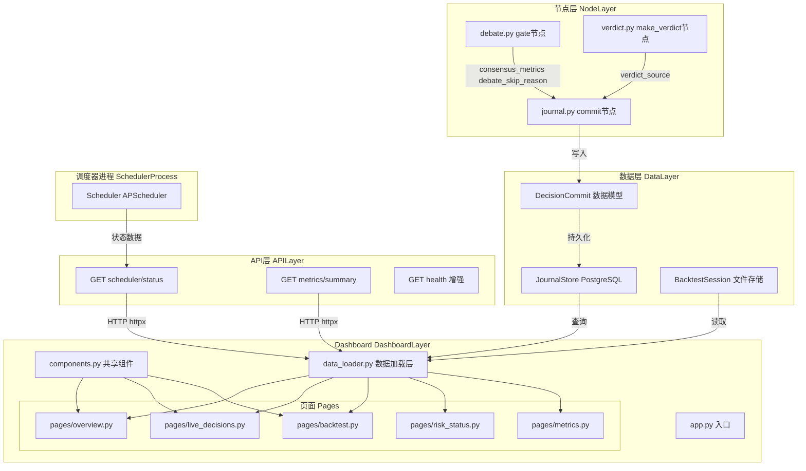
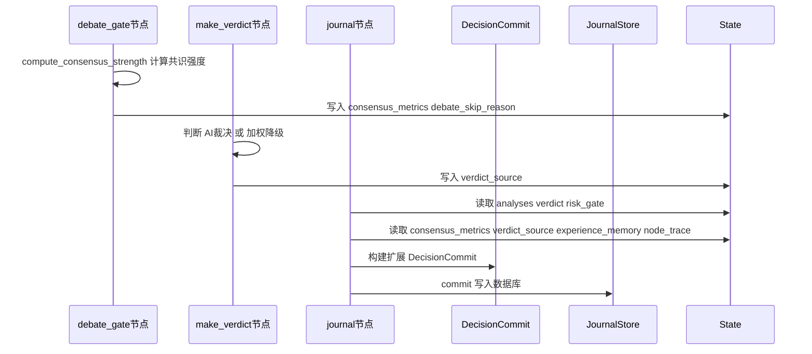
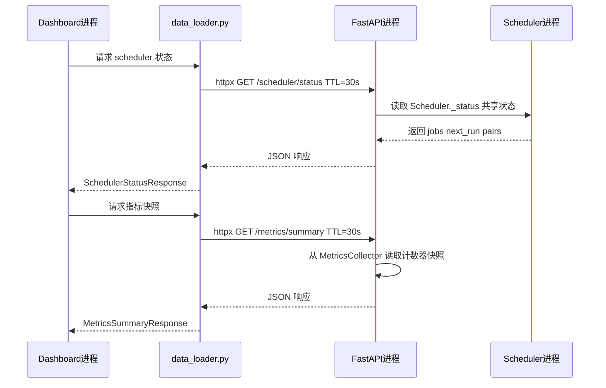
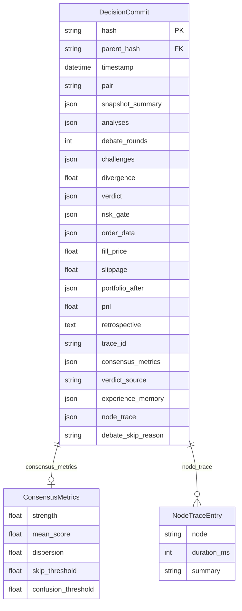

# 技术设计文档：Dashboard 全流程可观测性

## 概览

本功能将 CryptoTrader AI 的 Streamlit Dashboard 从一个四页骨架（约 35% 完成度）改造为具备完整全流程可观测性的监控平台。目标用户涵盖交易员、策略研究员、风控负责人和 SRE 工程师，核心价值在于让每一次实盘/回测决策的完整执行过程——从数据采集到最终执行——都可在 Dashboard 中逐层审查。

本设计覆盖四个层面的变更：（1）`DecisionCommit` 数据模型扩展，新增五个可观测性字段；（2）节点层（`debate.py`、`verdict.py`、`journal.py`）将共识指标、裁决来源、经验记忆注入日志；（3）FastAPI 新增 `/scheduler/status` 端点和 `/metrics/summary` 端点，作为跨进程数据桥梁；（4）Dashboard 重构为 `pages/` 子模块架构，提供五个功能页面。

### 目标

- 实现决策全流程可视化：数据采集 → 语言强化 → Agent 并行分析 → 辩论门控 → 辩论轮次 → 裁决 → 风控 → 执行
- 将辩论共识指标、裁决来源（AI/加权降级）、经验记忆注入持久化到 `DecisionCommit`
- 提供跨进程通信策略，通过 FastAPI HTTP 桥接获取 Scheduler 状态和 Prometheus 指标快照
- 建立可扩展的 Dashboard 模块化架构，支持独立页面开发

### 非目标

- 不引入 WebSocket 实时推送（保留 `st.rerun()` 定时刷新模式）
- 不实现 Dashboard 自身的用户认证系统
- 不将 Streamlit 迁移到其他前端框架
- 不修改 LangGraph 图拓扑或节点执行顺序
- 不实现自定义 Prometheus 指标采集（沿用现有 `MetricsCollector` 单例）

---

## 架构

### 现有架构分析

当前 `src/dashboard/app.py` 是单文件 Streamlit 应用，包含：
- `_run()` 辅助函数，用独立事件循环执行异步调用
- `@st.cache_data(ttl=10)` 数据加载函数
- 四个内联页面（Overview、Decisions、Risk Status、Backtest）

**关键缺口**：

1. `DecisionCommit` 缺少五个可观测性字段：`consensus_metrics`、`verdict_source`、`experience_memory`、`node_trace`、`debate_skip_reason`
2. `journal_trade` / `journal_rejection` 节点不持久化共识指标和经验记忆
3. Dashboard 无法跨进程获取 Scheduler 状态和 Prometheus 指标
4. 单文件架构难以扩展为五个功能完整的页面

### 架构模式与边界图



**架构决策**：

- **Dashboard 重构为 `pages/` 子模块**：每个页面独立文件，`components.py` 存放共享渲染函数，`data_loader.py` 集中所有缓存数据访问，`app.py` 只负责路由和配置加载。
- **跨进程通信采用 HTTP httpx + TTL 缓存**：Dashboard 进程通过 `httpx.get()` 调用 FastAPI 端点获取 Scheduler 状态和 Prometheus 指标快照，缓存 TTL=30s，避免轮询压力。
- **`DecisionCommit` 扩展而非替换**：新增五个可选字段，数据库通过 `ALTER TABLE` 迁移，内存 fallback 路径自动兼容。
- **节点层职责扩展**：`debate_gate` 节点已计算共识强度，结果直接写入 `state["data"]`，`journal` 节点从 state 读取并持久化；无需修改图拓扑。

### 技术栈

| 层 | 选型 / 版本 | 本功能角色 | 说明 |
|---|---|---|---|
| Dashboard 前端 | Streamlit（现有） | 五页面模块化架构 | 保留框架，重构为 pages/ 子模块 |
| HTTP 客户端 | httpx 0.27+（现有） | 跨进程 API 调用 | 复用已有导入约定 |
| API 服务 | FastAPI + Uvicorn（现有） | 新增 /scheduler/status、/metrics/summary | 追加路由，不改现有接口 |
| 数据存储 | PostgreSQL via SQLAlchemy async（现有） | DecisionCommit 扩展字段 | ALTER TABLE + 新列默认值 |
| 文件存储 | backtest/session.py（现有） | 回测会话持久化展示 | 已有 load_commits / list_sessions |
| 异步运行时 | asyncio + 独立事件循环（现有） | Dashboard _run() 辅助 | 保持现有模式 |
| 缓存 | st.cache_data(ttl=N)（现有） | 分层 TTL 缓存 | 组合数据加载器 |

---

## 系统流程

### 决策数据持久化流程



### Dashboard 跨进程数据流



---

## 需求可追溯性

| 需求 | 摘要 | 组件 | 接口 | 流程 |
|---|---|---|---|---|
| 1.1 | 决策历史列表，倒序、支持筛选 | LiveDecisionsPage、JournalStore | `log(limit, pair, page, page_size)` | Dashboard → JournalStore |
| 1.2 | 决策触发时间、交易对、市场价格 | DecisionDetailSection、DecisionCommit | `snapshot_summary.price` | Dashboard → JournalStore |
| 1.3 | 完整节点执行流水线展示 | NodeTracePipeline、DecisionCommit | `node_trace: list[NodeTraceEntry]` | 节点层 → Journal → Dashboard |
| 1.4 | 辩论跳过标注及原因 | NodeTracePipeline、DebateSkipBadge | `debate_skip_reason` | debate_gate → Journal → Dashboard |
| 1.5 | trace_id 展示 | DecisionDetailSection | `DecisionCommit.trace_id` | 现有字段，Dashboard 渲染 |
| 2.1 | 四 Agent 分析卡片（方向、置信度、充分性） | AgentAnalysisGrid | `AgentAnalysis` | Dashboard → JournalStore |
| 2.2 | reasoning 可展开/折叠 | ExpandableText | Streamlit expander | Dashboard 渲染 |
| 2.3 | 市场快照摘要（价格、波动率、regime tags） | SnapshotSummaryCard | `snapshot_summary + regime_tags` | 节点层 → Journal → Dashboard |
| 2.4 | 经验规则注入展示 | ExperienceMemorySection | `DecisionCommit.experience_memory` | 节点层 → Journal → Dashboard |
| 2.5 | data_sufficiency=low 视觉警告 | AgentAnalysisCard | `AgentAnalysis.data_sufficiency` | Dashboard 渲染 |
| 3.1 | 辩论轮次数和分歧度 | DebateSection | `DecisionCommit.debate_rounds, divergence` | 现有字段 |
| 3.2 | 每轮 challenges 按方分组 | ChallengesList | `DecisionCommit.challenges` | 现有字段，Dashboard 渲染 |
| 3.3 | 共识强度可视化（均值与标准差） | ConsensusMetricsChart | `DecisionCommit.consensus_metrics` | debate_gate → Journal → Dashboard |
| 3.4 | 跳过时的阈值与实际值对比 | DebateSkipDetail | `consensus_metrics + debate_skip_reason` | 扩展字段 → Dashboard |
| 3.5 | 裁决类型标注（AI vs 加权降级） | VerdictSourceBadge | `DecisionCommit.verdict_source` | make_verdict → Journal → Dashboard |
| 4.1 | 裁决结论全字段，AI/加权降级来源 | VerdictSection | `TradeVerdict + verdict_source` | Dashboard → JournalStore |
| 4.2 | 风控通过（绿色 + 检查列表） | RiskGateSection | `GateResult.passed` | Dashboard 渲染 |
| 4.3 | 风控拒绝（红色 + rejected_by/reason） | RiskGateSection | `GateResult.rejected_by, reason` | Dashboard 渲染 |
| 4.4 | 执行动作和止损触发状态 | ExecutionSection | `DecisionCommit.order, portfolio_after` | Dashboard 渲染 |
| 4.5 | 执行前后仓位和权益变化 | PortfolioChangeSummary | `portfolio_after` | Dashboard 渲染 |
| 5.1 | 回测汇总指标 + 权益曲线 | BacktestSummaryMetrics | `BacktestResult` | BacktestPage |
| 5.2 | 时间轴决策序列 | BacktestTimeline | `BacktestResult.decisions` | BacktestPage |
| 5.3 | 点选回测决策点展示完整详情 | BacktestDecisionDetail | 与实盘相同组件 | BacktestPage |
| 5.4 | 节点执行追踪展示 | NodeTracePipeline | `DecisionCommit.node_trace` | BacktestPage |
| 5.5 | 纯规则模式降级展示 | BacktestEmptyDecisionsFallback | `decisions=[]` 分支 | BacktestPage |
| 5.6 | 回测会话持久化，多次切换对比 | BacktestSessionSelector | `list_sessions() + load_commits()` | BacktestPage |
| 6.1 | 10s 刷新组合概览 | OverviewPage | `PortfolioManager` TTL=10s | OverviewPage |
| 6.2 | 风控状态（交易次数、电路熔断器、阈值） | RiskStatusPage | `RedisStateManager` | RiskStatusPage |
| 6.3 | 熔断器活跃时红色警告 + 手动重置按钮 | CircuitBreakerWidget | `RedisStateManager.reset_circuit_breaker()` | RiskStatusPage |
| 6.4 | Redis 不可连接时显示警告，不静默 | RiskUnavailableWarning | `rsm.available` 检查 | RiskStatusPage |
| 6.5 | 当前持仓列表 | PositionsTable | `portfolio.positions` | OverviewPage |
| 6.6 | Scheduler 下次触发时间和交易对 | SchedulerStatusWidget | GET /scheduler/status | OverviewPage |
| 7.1 | MetricsCollector 关键指标展示 | MetricsPage | GET /metrics/summary | MetricsPage |
| 7.2 | /metrics Prometheus 端点跳转链接 | MetricsPage | 静态链接 | MetricsPage |
| 7.3 | OTel trace 链接（OTLP_ENDPOINT 非空时） | TraceLink | `DecisionCommit.trace_id + OTLP_ENDPOINT` | Dashboard 渲染 |
| 7.4 | 流水线耗时和执行延迟历史趋势图 | LatencyTrendChart | GET /metrics/summary 历史数据 | MetricsPage |
| 7.5 | /metrics 不可访问时提示，不影响其他页面 | MetricsUnavailableWarning | httpx 异常捕获 | MetricsPage |
| 8.1 | 五页侧边栏导航 | app.py 路由 | URL query 参数 | app.py |
| 8.2 | URL query 参数保存页面状态 | app.py 路由 | `st.query_params` | app.py |
| 8.3 | 数据库连接失败时明确错误提示 | ErrorBoundary | `st.error() + st.stop()` | 所有页面 |
| 8.4 | 长文本截断 + 展开查看全文 | ExpandableText | Streamlit expander | components.py |
| 8.5 | 宽屏多列 / 窄屏单列 Agent 卡片 | AgentAnalysisGrid | `st.columns()` 响应式 | components.py |
| 8.6 | 分页控件，默认每页 20 条 | PaginationControls | `offset + limit` 参数 | LiveDecisionsPage |

---

## 组件与接口

### 组件总览

| 组件 | 领域/层 | 意图 | 需求覆盖 | 关键依赖 | 契约类型 |
|---|---|---|---|---|---|
| DecisionCommit（扩展） | 数据模型 | 新增五个可观测性字段 | 1.3, 1.4, 2.3, 2.4, 3.3, 3.5 | JournalStore, nodes/* | State |
| DecisionCommitRow（扩展） | 数据存储 | 数据库表新增五列 | 1.3, 1.4, 2.3, 2.4, 3.3, 3.5 | SQLAlchemy, PostgreSQL | Batch |
| debate_gate（扩展） | 节点层 | 输出 consensus_metrics 到 state | 3.3, 3.4 | convergence.py | State |
| make_verdict（扩展） | 节点层 | 输出 verdict_source 到 state | 3.5, 4.1 | debate/verdict.py | State |
| journal_trade / journal_rejection（扩展） | 节点层 | 读取并持久化五个新字段 | 1.3, 1.4, 2.3, 2.4, 3.3, 3.5 | JournalStore, DecisionCommit | State |
| SchedulerStatusEndpoint | API 层 | 跨进程 Scheduler 状态桥梁 | 6.6 | Scheduler | API |
| MetricsSummaryEndpoint | API 层 | 跨进程 Prometheus 指标快照 | 7.1, 7.4 | MetricsCollector | API |
| DashboardDataLoader | Dashboard | 集中缓存数据访问，含 HTTP 调用 | 全部 | JournalStore, httpx | Service |
| app.py（重构） | Dashboard 入口 | 路由 + 配置 + 页面分发 | 8.1, 8.2, 8.3 | pages/* | — |
| OverviewPage | Dashboard 页面 | 组合概览 + 持仓 + Scheduler 状态 | 6.1, 6.5, 6.6 | DashboardDataLoader, components | — |
| LiveDecisionsPage | Dashboard 页面 | 决策历史列表 + 全流程详情 | 1.1~1.5, 2.1~2.5, 3.1~3.5, 4.1~4.5 | DashboardDataLoader, components | — |
| BacktestPage | Dashboard 页面 | 回测运行 + 会话对比 + 决策详情 | 5.1~5.6 | DashboardDataLoader, components | — |
| RiskStatusPage | Dashboard 页面 | 风控状态 + 熔断器管理 | 6.2~6.4 | DashboardDataLoader, components | — |
| MetricsPage | Dashboard 页面 | Prometheus 指标 + 趋势图 | 7.1~7.5 | DashboardDataLoader, components | — |
| components.py | Dashboard 共享 | 可复用渲染函数 | 2.1, 2.2, 2.4, 2.5, 3.3, 8.4, 8.5 | — | Service |

---

### 数据模型层

#### DecisionCommit（扩展）

| 字段 | 详情 |
|---|---|
| Intent | 扩展核心决策记录模型，新增五个可观测性字段 |
| Requirements | 1.3, 1.4, 2.3, 2.4, 3.3, 3.5 |

**新增字段**：

```python
@dataclass
class ConsensusMetrics:
    """debate_gate 节点计算的共识指标快照。"""
    strength: float           # abs(mean_score) * (1 - pstdev)
    mean_score: float         # 各 Agent 评分均值
    dispersion: float         # 评分标准差
    skip_threshold: float     # 触发跳过的阈值（来自 config）
    confusion_threshold: float


@dataclass
class NodeTraceEntry:
    """单个节点的执行追踪记录。"""
    node: str
    duration_ms: int
    summary: str              # 节点输出摘要，最长 200 字符


# DecisionCommit 新增字段（追加到现有 dataclass）：
# consensus_metrics: ConsensusMetrics | None = None
# verdict_source: Literal["ai", "weighted", "hold_all_mock"] = "ai"
# experience_memory: dict[str, Any] = field(default_factory=dict)
# node_trace: list[NodeTraceEntry] = field(default_factory=list)
# debate_skip_reason: str = ""
```

**字段说明**：
- `consensus_metrics`：由 `debate_gate` 节点计算，无论辩论是否跳过均记录
- `verdict_source`：枚举字符串 `"ai" | "weighted" | "hold_all_mock"`，由 `make_verdict` 节点写入
- `experience_memory`：序列化的 GSSC 引擎注入结果（`success_patterns`/`forbidden_zones`/`strategic_insights` 摘要）
- `node_trace`：`run_graph_traced()` 返回的追踪列表，已转换为 `NodeTraceEntry` 列表
- `debate_skip_reason`：`debate_gate` 写入的跳过原因字符串

**不变量**：所有新字段均有默认值，数据库列允许 NULL，确保零停机迁移。

---

#### DecisionCommitRow（扩展）

| 字段 | 详情 |
|---|---|
| Intent | 数据库表新增五列，支持在线迁移 |
| Requirements | 1.3, 1.4, 2.3, 2.4, 3.3, 3.5 |

**新增数据库列**：

| 列名 | 类型 | 默认值 | 说明 |
|---|---|---|---|
| `consensus_metrics` | JSONB | `NULL` | ConsensusMetrics 序列化 |
| `verdict_source` | VARCHAR(20) | `'ai'` | 裁决来源标识 |
| `experience_memory` | JSONB | `NULL` | 经验记忆摘要 |
| `node_trace` | JSONB | `'[]'` | NodeTraceEntry 列表 |
| `debate_skip_reason` | VARCHAR(500) | `''` | 辩论跳过原因 |

**契约**：Batch [ x ]

迁移策略：`_sa_models()` 内 `DecisionCommitRow` 添加五个新 `Column` 声明；`_ensure_tables()` 调用 `create_all(checkfirst=True)` 对 PostgreSQL 执行 `ALTER TABLE` 添加新列；SQLite 走 `CREATE TABLE IF NOT EXISTS` 路径，直接包含新列。现有行的新列值为 NULL / 空，不影响读取。

**实现说明**：
- `_dc_to_row_dict()` 和 `_row_to_dc()` 同步扩展，处理 `None` 安全反序列化
- `_deserialize()` 内存路径同样扩展，保持内存 fallback 和 DB 路径行为一致

---

### 节点层

#### debate_gate（扩展）

| 字段 | 详情 |
|---|---|
| Intent | 在现有共识计算逻辑上，将 ConsensusMetrics 和跳过阈值写入 state |
| Requirements | 3.3, 3.4 |

**扩展点**：`debate_gate` 节点在返回值中追加 `consensus_metrics` 和 `debate_skip_reason`（已在当前代码中计算 `strength`、`mean_score`、`dispersion`）。扩展返回：

```python
return {
    "data": {
        "debate_skipped": skip,
        "debate_skip_reason": reason,
        "consensus_metrics": {
            "strength": strength,
            "mean_score": mean_score,
            "dispersion": dispersion,
            "skip_threshold": config.consensus_skip_threshold,
            "confusion_threshold": config.confusion_skip_threshold,
        },
    }
}
```

**依赖**：
- 入站：`convergence.compute_consensus_strength()`（已有，P0）
- 出站：ArenaState `data.consensus_metrics`（P0）

---

#### make_verdict（扩展）

| 字段 | 详情 |
|---|---|
| Intent | 在裁决结果中附加 verdict_source 字段，标识 AI/加权降级/全 mock hold |
| Requirements | 3.5, 4.1 |

**扩展点**：三个分支（`make_verdict_llm`、`make_verdict_weighted`、all-mock-hold）各自追加 `verdict_source` 字段：

```python
# make_verdict 返回值扩展
return {
    "data": {
        "verdict": {
            # ... 现有字段 ...
            "verdict_source": "ai" | "weighted" | "hold_all_mock",
        }
    }
}
```

`verdict_source` 的值由三个分支决定：`use_llm_verdict=True` 且未降级 → `"ai"`；降级到加权 → `"weighted"`；全 mock 强制 hold → `"hold_all_mock"`。

---

#### journal_trade / journal_rejection（扩展）

| 字段 | 详情 |
|---|---|
| Intent | 从 ArenaState 读取五个新可观测性字段，构建扩展 DecisionCommit |
| Requirements | 1.3, 1.4, 2.3, 2.4, 3.3, 3.5 |

**扩展点**：`build_commit()` 调用追加五个字段参数：

```python
commit = build_commit(
    # ... 现有参数 ...
    consensus_metrics=state["data"].get("consensus_metrics"),
    verdict_source=state["data"].get("verdict", {}).get("verdict_source", "ai"),
    experience_memory=state["data"].get("experience_memory", {}),
    node_trace=state["data"].get("node_trace", []),
    debate_skip_reason=state["data"].get("debate_skip_reason", ""),
)
```

**说明**：`node_trace` 来自 `run_graph_traced()` 调用方注入 `state["data"]["node_trace"]`；`experience_memory` 来自 `verbal_reinforcement` 节点已写入的 `state["data"]["experience_memory"]`。

---

### API 层

#### SchedulerStatusEndpoint

| 字段 | 详情 |
|---|---|
| Intent | 暴露 Scheduler 当前运行状态给 Dashboard 进程 |
| Requirements | 6.6 |

**契约**：API [ x ]

##### API 契约

| 方法 | 端点 | 响应 | 错误 |
|---|---|---|---|
| GET | `/scheduler/status` | `SchedulerStatusResponse` | 503（Scheduler 未运行）|

```python
class SchedulerJobStatus(BaseModel):
    job_id: str
    name: str
    next_run_time: datetime | None
    pairs: list[str]

class SchedulerStatusResponse(BaseModel):
    running: bool
    jobs: list[SchedulerJobStatus]
    cycle_count: int
    interval_minutes: int
    pairs: list[str]
```

**实现说明**：
- 注册为 `src/api/routes/scheduler.py`，`APIRouter(prefix="/scheduler")`
- Scheduler 实例通过 FastAPI lifespan 注入全局状态，或通过 `Scheduler._status` 类变量共享
- 若 Scheduler 未启动（独立进程模式），返回 `running=false` 和空 jobs
- Dashboard 调用：`httpx.get(f"{API_BASE}/scheduler/status", timeout=5.0)`

---

#### MetricsSummaryEndpoint

| 字段 | 详情 |
|---|---|
| Intent | 将进程内 Prometheus 计数器/直方图快照以 JSON 格式暴露给 Dashboard |
| Requirements | 7.1, 7.4 |

**契约**：API [ x ]

##### API 契约

| 方法 | 端点 | 响应 | 错误 |
|---|---|---|---|
| GET | `/metrics/summary` | `MetricsSummaryResponse` | 500（内部错误）|

```python
class MetricsSummaryResponse(BaseModel):
    llm_calls_total: int
    debate_skipped_total: int
    verdict_distribution: dict[str, int]     # {"long": N, "short": N, ...}
    risk_rejected_total: int
    risk_rejected_by_check: dict[str, int]   # {"daily_loss_limit": N, ...}
    trade_executed_total: int
    pipeline_duration_p50_ms: float
    pipeline_duration_p95_ms: float
    execution_latency_p50_ms: float
    execution_latency_p95_ms: float
    snapshot_time: datetime
```

**实现说明**：
- 注册在现有 `src/api/routes/metrics.py` 的新 GET `/metrics/summary` 路由（现有 GET `/metrics` 返回 Prometheus 文本格式，保持不变）
- 从 `get_metrics_collector()` 读取 prometheus-client 内部计数器，通过 `_value.get()` 提取当前值
- Dashboard TTL=30s 缓存此端点响应

---

### Dashboard 层

#### DashboardDataLoader

| 字段 | 详情 |
|---|---|
| Intent | 集中管理所有页面的数据加载，提供分层 TTL 缓存，封装异步→同步转换 |
| Requirements | 全部 |

**契约**：Service [ x ]

**职责与约束**：
- 所有 `@st.cache_data(ttl=N)` 装饰器集中在此模块，页面层不直接访问数据源
- 封装 `_run()` 辅助函数（独立事件循环），所有异步调用通过此函数
- HTTP 调用（Scheduler 状态、Metrics 快照）使用 `httpx.get()` 同步变体，TTL=30s
- 数据库连接失败时返回明确异常，由页面层捕获并调用 `st.error() + st.stop()`

##### Service 接口

```python
class DashboardDataLoader:

    @st.cache_data(ttl=10)
    def load_portfolio(db_url: str) -> PortfolioSummary: ...

    @st.cache_data(ttl=10)
    def load_journal(
        db_url: str,
        limit: int = 20,
        pair: str | None = None,
        offset: int = 0,
    ) -> list[DecisionCommit]: ...

    @st.cache_data(ttl=10)
    def load_commit_detail(db_url: str, commit_hash: str) -> DecisionCommit | None: ...

    @st.cache_data(ttl=10)
    def load_risk_status(redis_url: str) -> RiskStatusData | None: ...

    @st.cache_data(ttl=30)
    def load_scheduler_status(api_base_url: str) -> SchedulerStatusResponse | None: ...

    @st.cache_data(ttl=30)
    def load_metrics_summary(api_base_url: str) -> MetricsSummaryResponse | None: ...

    @st.cache_data(ttl=300)
    def list_backtest_sessions() -> list[str]: ...

    @st.cache_data(ttl=300)
    def load_backtest_session(session_id: str) -> list[dict]: ...
```

- 前置条件：`db_url` 非空且格式合法；`api_base_url` 格式为 `http://host:port`
- 后置条件：所有返回类型均含默认值或 `None`，不抛出非数据库致命异常
- 不变量：TTL 缓存键包含所有参数，不同参数组合不共享缓存

**实现说明**：
- 文件路径：`src/dashboard/data_loader.py`
- `PortfolioSummary`、`RiskStatusData` 为本模块定义的 `TypedDict`
- HTTP 调用超时 5s，异常时返回 `None`（页面层展示降级提示）

---

#### app.py（重构）

| 字段 | 详情 |
|---|---|
| Intent | Dashboard 入口：仅负责页面路由、配置加载和导航渲染 |
| Requirements | 8.1, 8.2, 8.3 |

**重构后结构**：

```
src/dashboard/
├── app.py                  # 入口：路由 + 配置 + 导航
├── data_loader.py          # 集中缓存数据访问
├── components.py           # 共享渲染组件
└── pages/
    ├── __init__.py
    ├── overview.py         # 需求 6.1, 6.5, 6.6
    ├── live_decisions.py   # 需求 1.x, 2.x, 3.x, 4.x
    ├── backtest.py         # 需求 5.x
    ├── risk_status.py      # 需求 6.2~6.4
    └── metrics.py          # 需求 7.x
```

**导航逻辑**：

```python
_PAGES = ["Overview", "Live Decisions", "Backtest", "Risk Status", "Metrics"]
# URL query 参数: ?page=Overview (等)
# 侧边栏 radio 同步 query_params
```

**实现说明**：
- `config = _get_config()` 通过 `@st.cache_resource` 加载，仅一次
- `_run()` 辅助函数从 `app.py` 移至 `data_loader.py`，各页面通过 `from dashboard.data_loader import run_async` 引用
- 数据库错误在各页面最顶层捕获，`st.error() + st.stop()` 阻止后续渲染

---

#### components.py（共享组件）

| 字段 | 详情 |
|---|---|
| Intent | 提供所有页面复用的渲染函数，无业务逻辑，仅 Streamlit 渲染 |
| Requirements | 2.1, 2.2, 2.4, 2.5, 3.3, 8.4, 8.5 |

**主要渲染函数**（接口签名）：

```python
def render_agent_analysis_grid(
    analyses: dict[str, AgentAnalysis],
    *,
    columns: int | None = None,  # None = 自动按屏宽决定，最多 4 列
) -> None: ...

def render_decision_detail(commit: DecisionCommit) -> None: ...

def render_node_trace_pipeline(node_trace: list[NodeTraceEntry]) -> None: ...

def render_verdict_section(
    verdict: TradeVerdict,
    verdict_source: str,
) -> None: ...

def render_risk_gate_section(risk_gate: GateResult) -> None: ...

def render_consensus_metrics_chart(
    consensus_metrics: ConsensusMetrics,
    analyses: dict[str, AgentAnalysis],
) -> None: ...

def render_debate_section(
    debate_rounds: int,
    challenges: list[dict],
    debate_skip_reason: str,
    consensus_metrics: ConsensusMetrics | None,
) -> None: ...

def render_experience_memory_section(
    experience_memory: dict[str, Any],
) -> None: ...

def render_expandable_text(
    label: str,
    text: str,
    *,
    preview_chars: int = 200,
) -> None: ...

def render_pagination_controls(
    total: int,
    page_size: int = 20,
    *,
    key: str = "page",
) -> tuple[int, int]: ...  # (offset, limit)
```

**实现说明**：
- `render_agent_analysis_grid`：`data_sufficiency == "low"` 时在卡片标题旁显示 `⚠️` 图标（需求 2.5）
- `render_node_trace_pipeline`：将节点列表渲染为横向流水线，每个节点显示名称和耗时，`debate_skipped=True` 的节点标注为灰色虚线框
- `render_consensus_metrics_chart`：使用 `st.bar_chart` 展示各 Agent 评分条形图 + `st.caption` 显示均值/标准差/强度
- `render_expandable_text`：前 `preview_chars` 字符直接展示，超出部分折叠在 `st.expander` 内

---

#### LiveDecisionsPage

| 字段 | 详情 |
|---|---|
| Intent | 实盘决策历史列表 + 可选详情展开，五大模块完整可观测性展示 |
| Requirements | 1.1~1.5, 2.1~2.5, 3.1~3.5, 4.1~4.5, 8.4~8.6 |

**页面结构**：

```
LiveDecisionsPage
├── 筛选栏（交易对下拉、分页控件）         # 需求 1.1, 8.6
├── 决策列表（倒序 DataFrame 可点击行）
└── 决策详情（条件渲染，点击行后展开）
    ├── DecisionHeaderSection               # 需求 1.2, 1.5
    ├── NodeTracePipeline                   # 需求 1.3, 1.4
    ├── AgentAnalysisGrid × 4              # 需求 2.1~2.5
    ├── ExperienceMemorySection             # 需求 2.4
    ├── DebateSection                       # 需求 3.1~3.5
    ├── VerdictSection                      # 需求 4.1
    └── RiskGateSection + ExecutionSection  # 需求 4.2~4.5
```

**实现说明**：
- 列表使用 `st.dataframe(on_select="rerun")` 捕获行点击事件（Streamlit 1.30+）；若版本不支持，降级为 `st.selectbox` 选择 hash
- 分页：`load_journal(limit=page_size, offset=offset)` 传参，通过 `render_pagination_controls()` 获取 offset/limit
- `trace_id` 展示时，若 `OTLP_ENDPOINT` 非空则渲染为可点击的 OTel trace 链接（需求 1.5, 7.3）

---

#### BacktestPage

| 字段 | 详情 |
|---|---|
| Intent | 回测运行、会话持久化对比、决策时间轴回放，复用 LiveDecisionsPage 同款详情组件 |
| Requirements | 5.1~5.6 |

**页面结构**：

```
BacktestPage
├── 标签页（Run New Backtest | Load Session）   # 需求 5.6
│   ├── Run New：参数表单 + Run 按钮
│   └── Load Session：会话列表下拉
├── BacktestSummaryMetrics（5 项指标卡片）        # 需求 5.1
├── EquityPriceChart                             # 需求 5.1
├── BacktestTimeline（DataFrame 时间轴）          # 需求 5.2
├── DecisionDetailSection（点选决策点）            # 需求 5.3, 5.4
│   └── 复用 components.py 全套组件
└── BacktestEmptyDecisionsFallback               # 需求 5.5
```

**实现说明**：
- 会话持久化：`BacktestEngine.run()` 结束后调用 `save_commits()` + `save_result()`，返回 `session_id`；Load Session 标签页通过 `list_sessions()` + `load_commits()` 读取
- `node_trace` 来自 `DecisionCommit.node_trace`（已由扩展的 journal 节点写入）
- 纯规则模式（`decisions=[]`）时隐藏 `DecisionDetailSection` 和 `AgentAnalysisGrid`，仅显示权益曲线和交易列表

---

#### OverviewPage

| 字段 | 详情 |
|---|---|
| Intent | 实时组合概览 + 持仓列表 + Scheduler 下次触发信息 |
| Requirements | 6.1, 6.5, 6.6 |

**实现说明**：
- 权益曲线使用 `st.line_chart`，每 10s 通过 `st.rerun()` 刷新（`time.sleep(10)` 放在页面末尾的 `st.empty()` 占位块）
- Scheduler 状态通过 `load_scheduler_status(api_base_url)` 获取，展示 `next_run_time` 和 `pairs`；API 不可达时显示"调度器状态不可用"，不崩溃
- 持仓列表渲染为 `st.table()`，方向标识为 Long/Short

---

#### RiskStatusPage

| 字段 | 详情 |
|---|---|
| Intent | 风控状态实时展示，包含熔断器手动重置功能 |
| Requirements | 6.2~6.4 |

**实现说明**：
- `rsm.available=False` 时渲染 `st.warning("风控状态不可用 — Redis 未连接")` 并提前返回，不静默（需求 6.4）
- 熔断器 ACTIVE 时整个卡片背景使用 `st.error()` 容器渲染（需求 6.3）
- 重置按钮调用 `_run(rsm.reset_circuit_breaker())` 后 `st.rerun()`

---

#### MetricsPage

| 字段 | 详情 |
|---|---|
| Intent | Prometheus 指标快照展示 + /metrics 端点跳转链接 + 延迟趋势图 |
| Requirements | 7.1~7.5 |

**实现说明**：
- `load_metrics_summary()` 失败时渲染 `st.warning("指标端点不可用")` 并 return，不影响其他页面（需求 7.5）
- `/metrics` 端点链接通过 `st.link_button()` 渲染（需求 7.2）
- `pipeline_duration_p50_ms` / `p95_ms` 使用 `st.metric()` 展示（需求 7.4）；历史趋势图数据来自 `MetricsSummaryResponse`（快照时间戳 + 值），存储在 `st.session_state` 中累积多次采样

---

## 数据模型

### 领域模型

**核心聚合**：`DecisionCommit`——一次完整交易决策的不可变快照，包含从数据采集到执行的全部信息。新增字段以嵌套值对象（`ConsensusMetrics`、`NodeTraceEntry`）形式挂载，保持聚合边界不变。

**新增值对象**：

- `ConsensusMetrics`：debate_gate 节点计算结果的快照，包含共识强度、均值、标准差和阈值参数
- `NodeTraceEntry`：单个节点执行记录，含节点名、耗时毫秒和输出摘要

**业务规则**：
- `verdict_source` 仅在 `TradeVerdict.action` 非 `"hold"` 或为强制 hold 时才有意义
- `consensus_metrics` 在 `debate_rounds=0`（辩论跳过）时也应存在，反映跳过决策的依据
- `node_trace` 条目顺序与节点执行顺序一致，时间戳单调递增

### 逻辑数据模型



### 物理数据模型

**PostgreSQL `decision_commits` 表新增列**（`ALTER TABLE`，在线迁移）：

```sql
ALTER TABLE decision_commits
    ADD COLUMN IF NOT EXISTS consensus_metrics   JSONB         DEFAULT NULL,
    ADD COLUMN IF NOT EXISTS verdict_source      VARCHAR(20)   DEFAULT 'ai',
    ADD COLUMN IF NOT EXISTS experience_memory   JSONB         DEFAULT NULL,
    ADD COLUMN IF NOT EXISTS node_trace          JSONB         DEFAULT '[]',
    ADD COLUMN IF NOT EXISTS debate_skip_reason  VARCHAR(500)  DEFAULT '';
```

**索引**：`verdict_source` 不需要索引（基数低，全表扫描合理）；`consensus_metrics` 的 `strength` 值若需要范围查询，可后续添加表达式索引，本期不包含。

**SQLite 回退路径**：内存 fallback 的 `_serialize()` / `_deserialize()` 通过 `asdict()` 自动序列化新字段，无需额外处理。

### 数据契约与集成

**API 数据传输**：

`GET /scheduler/status` 响应：
```json
{
  "running": true,
  "jobs": [{"job_id": "trading_cycle", "name": "Trading cycle", "next_run_time": "2026-03-15T10:00:00Z", "pairs": ["BTC/USDT"]}],
  "cycle_count": 42,
  "interval_minutes": 240,
  "pairs": ["BTC/USDT"]
}
```

`GET /metrics/summary` 响应：
```json
{
  "llm_calls_total": 1024,
  "debate_skipped_total": 312,
  "verdict_distribution": {"long": 88, "short": 65, "hold": 201},
  "risk_rejected_total": 45,
  "risk_rejected_by_check": {"daily_loss_limit": 12, "volatility": 33},
  "trade_executed_total": 153,
  "pipeline_duration_p50_ms": 4200.0,
  "pipeline_duration_p95_ms": 11500.0,
  "execution_latency_p50_ms": 150.0,
  "execution_latency_p95_ms": 800.0,
  "snapshot_time": "2026-03-15T09:55:00Z"
}
```

---

## 错误处理

### 错误策略

本功能遵循"优雅降级"原则：单个数据源不可用时，对应模块显示明确提示，其他页面和模块不受影响。禁止静默吞异常。

### 错误分类与响应

**数据库不可达**（页面级）：
- 症状：`JournalStore.log()` 或 `PortfolioManager.get_portfolio()` 抛出异常
- 响应：`st.error(f"数据库连接失败: {e}")` + `st.stop()`
- 影响范围：当前页面，其他页面不受影响

**Redis 不可达**（模块级）：
- 症状：`RedisStateManager.available == False`
- 响应：`st.warning("风控状态不可用 — Redis 未连接")`，提前返回，不调用 `st.stop()`
- 约束：不可静默（需求 6.4）

**FastAPI 端点不可达**（组件级）：
- 症状：`httpx.get()` 超时或连接错误
- 响应：`load_scheduler_status()` 返回 `None`；`load_metrics_summary()` 返回 `None`
- 页面层检查：`if data is None: st.warning("..."); return`

**/metrics Prometheus 端点不可访问**（MetricsPage 级）：
- 症状：`load_metrics_summary()` 返回 `None`
- 响应：`st.warning("指标端点不可用")` + `return`，MetricsPage 以外的页面不受影响（需求 7.5）

**节点层数据缺失**（Journal 节点）：
- 症状：`state["data"].get("consensus_metrics")` 返回 `None`（旧版流程或 backtest 模式）
- 响应：`DecisionCommit.consensus_metrics = None`，Dashboard 渲染时条件判断，不展示该模块

### 监控

- 所有 `except Exception` 块保留 `logger.debug/warning(exc_info=True)`，与项目规范一致
- FastAPI HTTP 错误通过现有结构化日志记录
- Dashboard HTTP 调用失败通过 `logger.debug()` 记录，不暴露给用户日志流

---

## 测试策略

### 单元测试

- `test_models.py`：验证 `DecisionCommit` 新字段默认值、`ConsensusMetrics` 和 `NodeTraceEntry` dataclass 约束
- `test_journal_store.py`：覆盖 `_dc_to_row_dict` / `_row_to_dc` 对五个新字段的序列化往返；SQLite 路径的 `None` 安全处理
- `test_debate_gate.py`：验证 `debate_gate` 节点返回值包含 `consensus_metrics` 和 `debate_skip_reason`
- `test_make_verdict.py`：验证三个分支（AI/weighted/hold_all_mock）写入正确的 `verdict_source`
- `test_scheduler_endpoint.py`：mock `Scheduler` 对象，验证 `/scheduler/status` 响应结构
- `test_metrics_summary_endpoint.py`：mock `MetricsCollector`，验证 `/metrics/summary` 响应结构和计数值

### 集成测试

- `test_journal_integration.py`：完整流程——`debate_gate` → `make_verdict` → `journal_trade` → `JournalStore.log()` → 验证 `DecisionCommit` 五个新字段持久化正确
- `test_dashboard_data_loader.py`：mock `JournalStore` 和 httpx，验证 `DashboardDataLoader` 的 TTL 缓存和降级行为
- `test_db_migration.py`：验证现有数据库（无新列）调用 `_ensure_tables()` 后新列存在，现有行读取正常

### 端到端测试

- 手动回归：运行 `backtest` 后打开 Dashboard Backtest 页面，验证会话列表显示、时间轴渲染、点选详情完整展示
- 手动回归：关闭 Redis，打开 Risk Status 页面验证显示警告而非崩溃
- 手动回归：关闭 FastAPI 进程，打开 Overview 页面验证 Scheduler 状态显示"不可用"

---

## 可选章节

### 性能与可扩展性

- `node_trace` 存储在 JSONB 列，每次决策预估 10-20 个节点，每个节点约 200 字节，单记录额外开销 < 4KB，可接受
- `experience_memory` 摘要限制存储精简版（仅 `pattern + rate + maturity`，不含完整 conditions），控制单记录大小 < 8KB
- `DashboardDataLoader` 分层 TTL：组合/风控（10s）、API 桥接（30s）、会话列表（300s），平衡实时性和 API 压力
- Dashboard 分页默认每页 20 条（需求 8.6），防止大量历史数据一次性加载导致 UI 卡顿

### 迁移策略

**数据库迁移**（零停机）：


- 迁移步骤：部署 → 自动建表/加列 → 旧记录按 `None` 处理 → 新记录完整写入
- 回滚触发：新列 `ALTER TABLE` 失败（PostgreSQL 在线 DDL 应始终成功）
- Dashboard 向前兼容：所有新字段渲染均使用 `if commit.consensus_metrics is not None:` 保护

**Dashboard 代码替换**（非渐进式）：直接替换 `app.py`，新建 `pages/`、`components.py`、`data_loader.py`，不保留旧的内联页面代码，与设计原则"无向后兼容需求"一致。
